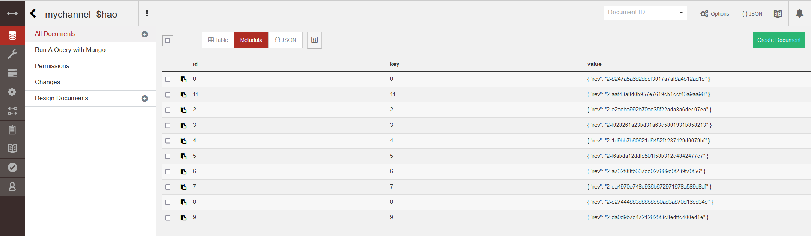

## Abstract
https://github.com/github1coder/MedicalChaincode

TODO: 完成基于区块链的EHR医疗系统，数据集参照MIMICⅢ https://mimic.mit.edu

## Update
### 修改数据结构，全部改为string，后续再改回去
### 保留AddMedicalRecord参数，但改了内部实现逻辑
### 写了两个脚本config.sh和command.sh，实现批量写入MIMICⅢ数据集log.csv的功能
该功能实现尚有一些问题
- 删去了数据中的单引号
- 对于数据量过大的记录(在log.csv中的记录10)不能有效写入，因为超出了linux对参数列表大小的限制
```
cd path/to/chaincode
source config.sh
source command.sh
```


## Result
进入这个网址，是couchdb的本地端口 http://localhost:5984/_utils

账户：admin

密码：adminpw

点进 mychannel_$hao 就可以看到有11条记录



## Architecture