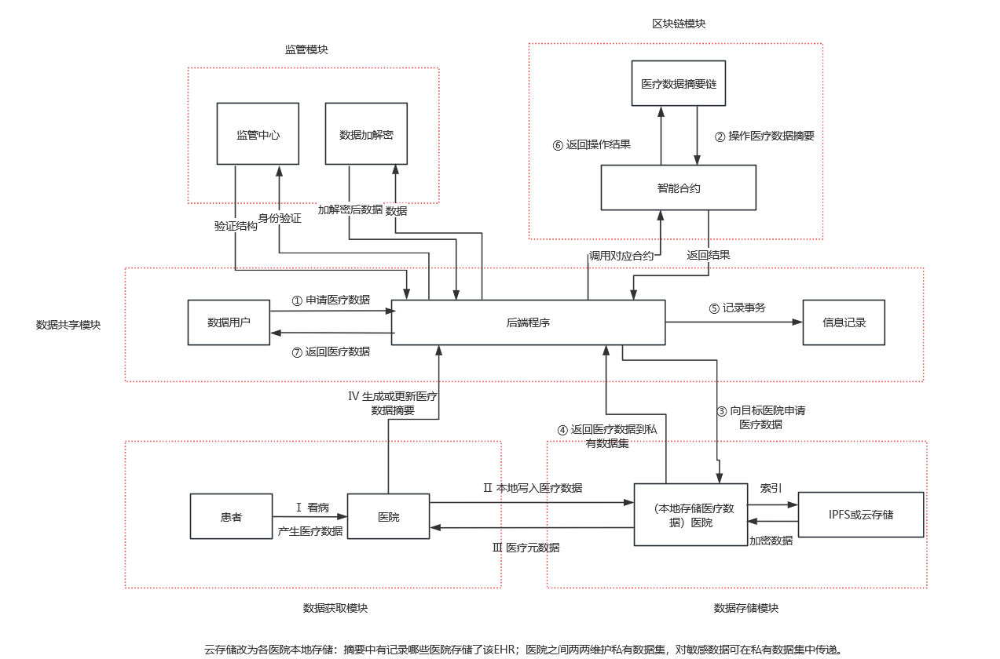

## Abstract
https://github.com/github1coder/MedicalChaincode

TODO: 完成基于区块链的EHR医疗系统，数据集参照MIMICⅢ https://mimic.mit.edu

## Update
### 将链码的文本解析和事务记录功能都下推到后端部分
### 增加摘要链
### 完成私有数据的增删查,但功能和zinan组负责的权限管理其实有重叠,所以暂时未敲定
```
cd path/to/back-end
source config.sh
```


## Result
进入这个网址，是couchdb的本地端口 

http://localhost:5984/_utils   Org1

http://localhost:7984/_utils   Org2

账户：admin

密码：adminpw

cloud文件夹中存放医疗数据读写的结果,可以保证当前操作的结果最新,但不保证所有文件最新; LOG文件记录事务

back-end默认设置为Org1操作,因此当添加私有数据后在5984端口查看可以看到私有数据集合,切换端口7984后就看不到了

如果是上云数据,查询摘要链可以看到url,也可以通过get函数直接下拉数据到本地文件,注意url的有效期默认为24h

可以记录事务,目前就是都写在一个LOG日志文件中,从上到下由新到旧


## Architecture

